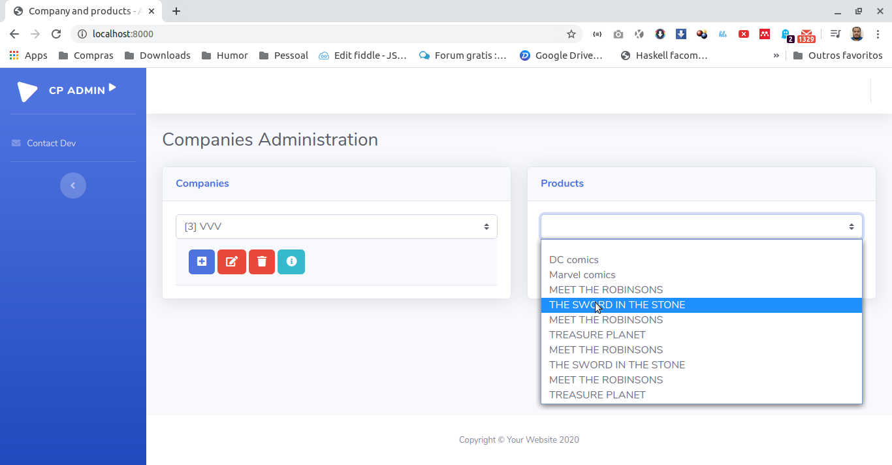
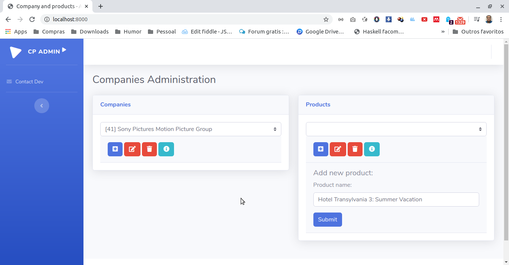
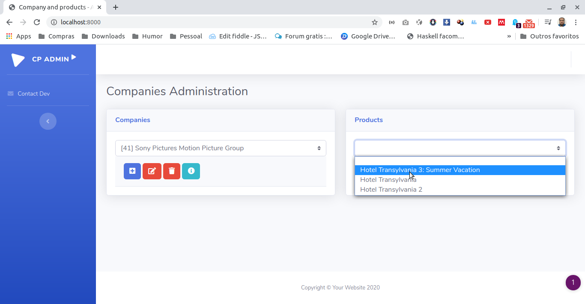

# Teste Backend - Casa Magalhães

## Folder structure
```
root
│   README.md
│
└───api-company-node-psql
│   │
│   └───data
│       │   script.sql
│   
└───angularjs-client
    │   
```

## Database modeling
- **DBMS** PostgreSQL;

### Database structure

```
│ COMPANY │                │   PRODUCTS  │
│ id      │ 1 ---------- n │  id         │
│ name    │                │  name       │
                           │  company_id │
```

*`PRODUCTS.company_id` is a FK for `COMPANY.id`*

### Import data
`$ psql -h hostname -d company_control_api -U username -f script.sql`

## NodeJS Backend - RESTFul` api-company-node-psql` folder
Listening on 4001 port.

### How to run

- `npm init -y`
- `npm install`
- `npm run dev`

### Avaliable HTTP verbs

#### Companies
- GET:
    - `/companies` : get all companies;
    - `/company/:id` : get a company by id.
- POST    
    - `/company` : add a new company.
- DELETE
    - `/company/:id` : delete company by id.
- PUT
    - `/company/:id` : update a company by id.

#### Products
- GET:
    - `/products` : get all products;
    - `/product/:id` : get a product by id;
    - `/products/:id` : get products by company id.
- POST    
    - `/product` : add a new product.
- DELETE
    - `/product/:id` : delete product by id.
- PUT
    - `/product/:id` : update a product by id.

## AngularJS Frontend
`angularjs-client` folder
Runnig on 8000 port.

### Technology Stack

- AngularJS
- jQuery
- HTML
- CSS
- Bootstrap
- Aewsome Fonts

### How to run
- `npm init -y`
- `npm install`
- `npm start`

#### Screens




## Miscellaneous
- `kill_port.sh` is a Shell script to close the connections of a especific port.

